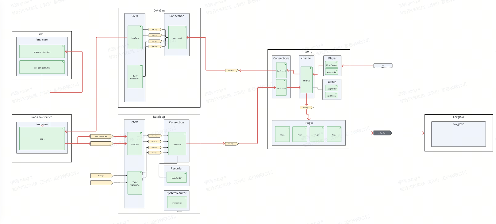

# Introduction
https://tatbb7xvhfr.feishu.cn/wiki/P2Ozwe5sRiadEyk308VcTTqnnag?from=from_copylink

- Dataloop APP  
- XMT2
- DataSim App
- Foxglove

## record
    Apps --> imo_com_service --> Dataloop App --> XMT2 --> files

## replay
    files --> XMT2(plugin) --> foxglove

## sim
    files --> XMT2 --> DataSIm App --> imo_com_service --> Apps --> imo_com_service --> Dataloop App --> XMT2(plugin) --> foxglove
    

# User Manual
https://tatbb7xvhfr.feishu.cn/wiki/OGuJwlFD1ixNcpkI2X5cDa0Fntc?from=from_copylink

## 1. replay
### 1. open the xmt2
    -- paht: xmt_xxxx/bin/xmt2
    -- topic --> hash config --> choose the hash file(path: xmt_xxxx/topic-hash-xxxx.json)
    -- Gobal plugin should find topic lists, if not, you need choose the hash file again    and click reload. 

### 2. ReplayFile --> "+"(choose the bag file)

### 3. double click the replay file
    -- choose topics which you want to replay
    -- click "start" to replay

### 4. open foxglove
    -- click model server and foxglove
    -- choose the layout(saved by yourself)

## 2. record 
### 0. open the xmt2

### 1. connect to J6E
    -- create a new connection
       -- name: J6E_dalo
       -- ip: 192.168.1.100
       -- port:12345
       -- type: dalo
    -- click "connect" (green light mean connected)

### 2. load hash file
    -- topic --> hash config --> choose the hash file(path: xmt_xxxx/topic-hash-xxxx.json)

### 3. double click the J6E_dalo 
    -- choose the topics which you want to record
    -- check the topics is mapped Hasplugin

### 4. create a new writer file
    -- you can choose the path to save bag file
    -- choose the topics which you want to record
    -- choose the time of slice

### 5. click "start" to record(right down)

## 3. sim
### 0. start com_service
    -- . ./etc/imo_com/imo_mdw_init.bash
    -- opt/imo_com_service/bin/imo_com_service

### 1. start control_app
    -- . ./etc/imo_com/imo_mdw_init.bash
    -- opt/DrivingControl/bin/DrivingControl
    
### 2. start datasim_app and dataloop_app (download from ci platform)
    
    2.1 start datasim_app
    -- . ./etc/imo_com/imo_mdw_init.bash
    -- bin/datasim_app

    2.2 start dataloop_app
    -- . ./etc/imo_com/imo_mdw_init.bash
    -- opt/dataloop_app/bin/dataloop_app

### 3. connect to datasim_app and dataloop_app
    -- create a new connection
       -- name: datasim_ubuntu
       -- ip: 127.0.0.1
       -- port:12346
       -- type: sim
    -- create a new connection
       -- name: dataloop_ubuntu
       -- ip: 127.0.0.1
       -- port:12345
       -- type: dalo
    
### 4. choose topics which you need to sim
    -- double click the datasim_ubuntu
    -- click "create" and choose the topics
       -- valin_pilot_chassis_recv
       -- valin_pilot_vehicle_recv
       -- driving_assist_func_recv
       -- driving_state_recv
       -- odo_local_recv
       -- planning_result_recv
       -- hmi_command_recv
    -- click "sync" to sync the topics

### 5. replay the mcap file

### 6. start foxglove to show the sim results

# used bag to record and replay
https://tatbb7xvhfr.feishu.cn/wiki/LTynwwmPHiw6VpkFyynczv0XnEh?from=from_copylink

